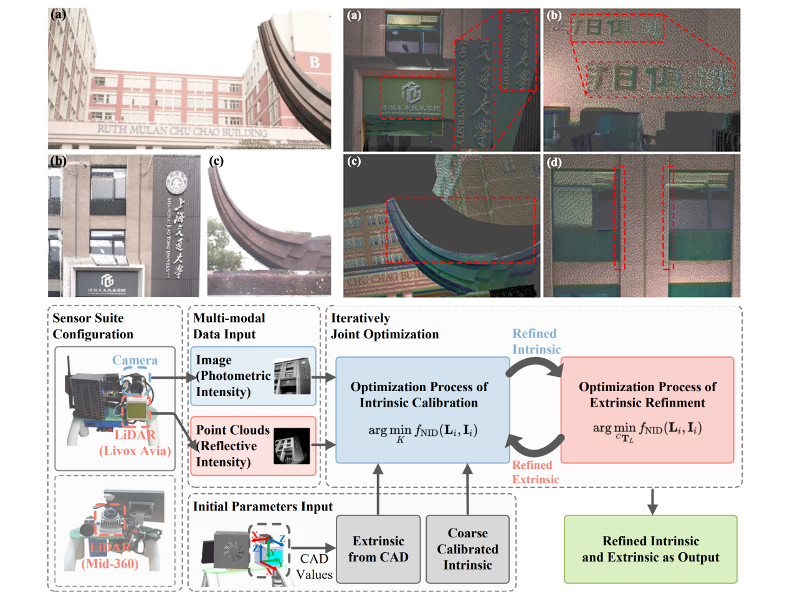
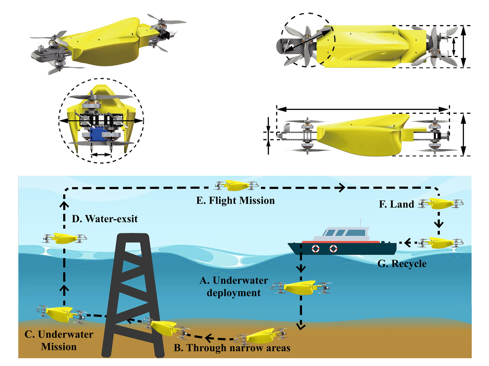
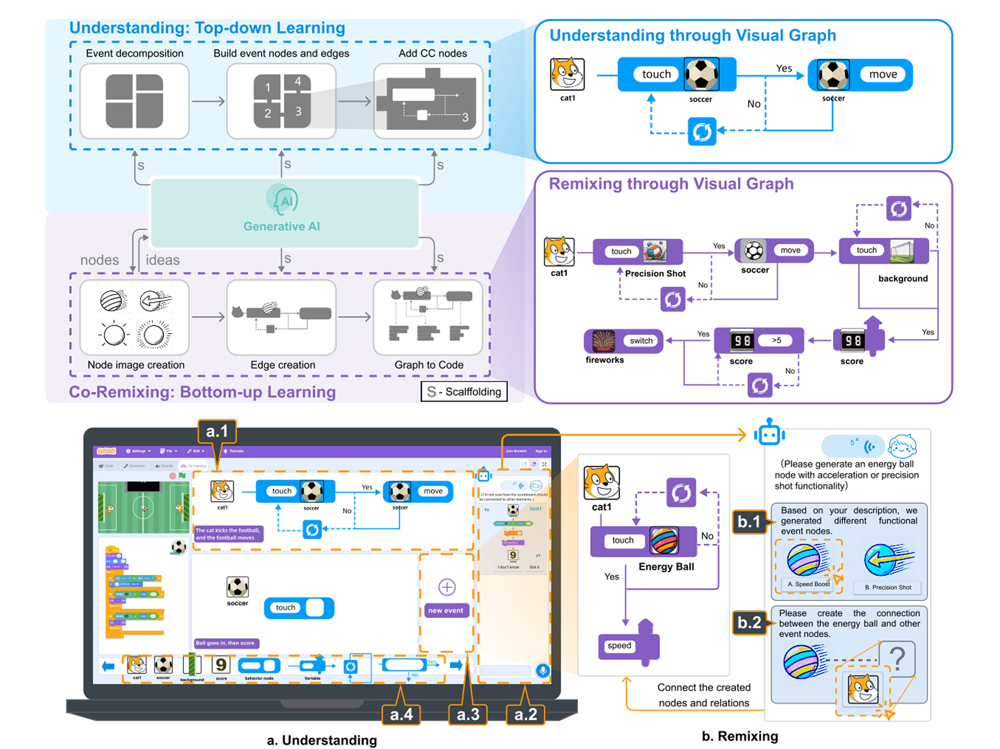

::: {#hero-heading}
## Personal Profile {style="margin-top: 0;"}

Hi! I am an incoming Ph.D. student in the Department of Computer Science and Engineering (CSE) at The Hong Kong University of Science and Technology (HKUST) for Fall 2026, where I will be supervised by [Prof. Yinghao Xu](https://justimyhxu.github.io/). Currently, I am working as a research intern at Ant Group. I am pursuing and will receive my Bachelor of Engineering in Industrial Design (Mechanical) from Shanghai Jiao Tong University (SJTU).

In Fall 2025, I was an exchange student in CSE at HKUST, where I also served as a visiting student in the [HKUST Aerial Robotics Group](https://uav.hkust.edu.hk/). During my undergraduate studies at SJTU, I worked as a research intern at the Global Institute of Future Technology, under the supervision of [Prof. Tong Qin](https://qintong.xyz/). Prior to this, I worked as a research intern at the College of Computer Science and Technology, Zhejiang University, supervised by [Prof. Lingyun Sun](https://person.zju.edu.cn/sly#) and [Prof. Liuqing Chen](https://person.zju.edu.cn/chenlq), and at the School of Oceanography, SJTU, supervised by [Prof. Zheng Zeng](https://soo.sjtu.edu.cn/teacher-list/zengzheng.html).

My research focuses on deploying intelligent robotic systems in the physical world, with developing scalable data acquisition paradigms to facilitate generalizable dexterous manipulation in unstructured environments.
:::

## Publications {#publications}

:::: {.columns}
::: {.column width="22%"}
{style="border-radius: 8px; box-shadow: 0 4px 8px rgba(0,0,0,0.1); width: 100%; aspect-ratio: 4 / 3; object-fit: cover;"}
:::
::: {.column width="3%"}
:::
::: {.column width="75%"}
**Direct, Targetless and Automatic Joint Calibration of LiDAR-Camera Intrinsic and Extrinsic**  
**Yishu Shen**, Sheng Hong, Shaojie Shen, Tong Qin  
*IEEE/RSJ International Conference on Intelligent Robots and Systems (IROS)*, 2025.  
[[Paper](https://ieeexplore.ieee.org/document/11247599)]  [[Code](https://github.com/sys111111/Joint_Direct_LiDAR_Camera_Calibration)]
:::
::::

 

:::: {.columns}
::: {.column width="22%"}
{style="border-radius: 8px; box-shadow: 0 4px 8px rgba(0,0,0,0.1); width: 100%; aspect-ratio: 4 / 3; object-fit: cover;"}
:::
::: {.column width="3%"}
:::
::: {.column width="75%"}
**Nezha-MB: Design and implementation of a Morphing Hybrid Aerial-Underwater vehicle**  
Zhuxiu Xu\*, **Yishu Shen\***, Yuanbo Bi, Baichuan Zeng, Zheng Zeng &nbsp; (* denotes equal contribution)  
*IEEE International Conference on Robotics and Automation (ICRA)*, 2025.  
[[Paper](https://ieeexplore.ieee.org/document/11127620)]
:::
::::

 

:::: {.columns}
::: {.column width="22%"}
{style="border-radius: 8px; box-shadow: 0 4px 8px rgba(0,0,0,0.1); width: 100%; aspect-ratio: 4 / 3; object-fit: cover;"}
:::
::: {.column width="3%"}
:::
::: {.column width="75%"}
**GS-LIVO: Real-Time LiDAR, Inertial, and Visual Multi-sensor Fused Odometry with Gaussian Mapping**  
Sheng Hong, Chunran Zheng, **Yishu Shen**, Changze Li, Fu Zhang, Tong Qin, Shaojie Shen  
*IEEE Transactions on Robotics (TRO)*, 2025. 
[[Paper](https://ieeexplore.ieee.org/document/11049044)]
:::
::::

 

:::: {.columns}
::: {.column width="22%"}
{style="border-radius: 8px; box-shadow: 0 4px 8px rgba(0,0,0,0.1); width: 100%; aspect-ratio: 4 / 3; object-fit: cover;"}
:::
::: {.column width="3%"}
:::
::: {.column width="75%"}
**Design and Implementation of a Bone-shaped Hybrid Aerial Underwater Vehicle**  
Yuanbo Bi, Zhuxiu Xu, **Yishu Shen**, Zheng Zeng, Lian Lian  
*IEEE Robotics and Automation Letters (RAL)*, 2024. *(Presented at IROS, 2025)*  
[[Paper](https://ieeexplore.ieee.org/abstract/document/10577093)]
:::
::::

 

:::: {.columns}
::: {.column width="22%"}
{style="border-radius: 8px; box-shadow: 0 4px 8px rgba(0,0,0,0.1); width: 100%; aspect-ratio: 4 / 3; object-fit: cover;"}
:::
::: {.column width="3%"}
:::
::: {.column width="75%"}
**CoRemix: Supporting Online Learning in Scratch Community with Visual Flowchart and Generative AI**  
Yunnong Chen, Xinyu Yu, **Yishu Shen**, Ruiyi Liu, Lingyun Sun, Liuqing Chen  
*International Journal of Human–Computer Interaction (IJHCI)*, 2025.  
[[Paper](https://www.tandfonline.com/doi/abs/10.1080/10447318.2025.2559053)]
:::
::::

---

## Award {#award}

* **National Scholarship**, 2025
* **National Scholarship**, 2024
* **Xiaomi Scholarship**, 2023
* **Second Prize, 2024 China Robocup Competition**, 2024